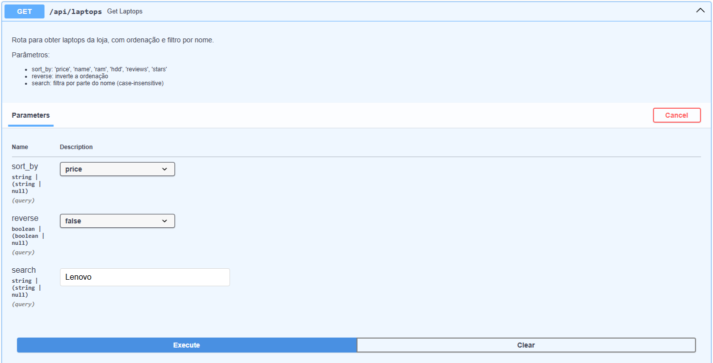

# LapScraping

LapScraping é um serviço de Scraping de Laptops do site: https://webscraper.io/test-sites/e-commerce/static/computers/laptops.

## Como usar?

1. Para usar o serviço, primeiramente, clone o repositório:

    ```
    git clone https://github.com/Nando2003/lapscraping.git
    ```

2. Crie a .env com os proxies (caso ache necessário):

    ```
    PROXIES_LIST = "PROXY1, PROXY2"
    ```

3. Verifique se tem o docker na maquina e execute o projeto:

    ```
    docker-compose up --build 
    ```

4. Quando o docker iniciar acesse o docs:

    ```
    http://localhost:3100/docs
    ```

5. Agora é só testar a API! Exemplo de retorno:

    ```json
    [
        {
            "name": "string",
            "configs": {
                "screen_spec": "string",
                "cpu": "string",
                "ram": "string",
                "hdd": "string",
                "os": "string",
                "graphics_card": "string",
                "keyboard_layout": "string"
            },
            "base_price": 0,
            "image_url": "string",
            "reviews": {
                "stars": 0,
                "amont_of_reviews": 0
            },
                "price_variations": {
                "additionalProp1": 0,
                "additionalProp2": 0,
                "additionalProp3": 0
            }
        }
    ]
    ```

6. Caso queria listar os laptops em ordem de preço do menor para o maior, basta passar como queryParam `sort_by` como `"price"` e o `reserve` como `False`.


## Tecnologias usadas:

- **Python 3.10.X**

- **Tenacity:** Foi usada caso a requisição para o site falhe

- **Fast API:** Usada com o propósito de servir como um API, para que os dados capturados possam ser usados em outras aplicações

- **Requests:** Sua principal funcionalidade é captar o HTML do site

- **BS4:** Foi usada para extrair informações importantes do HTML

##

##
